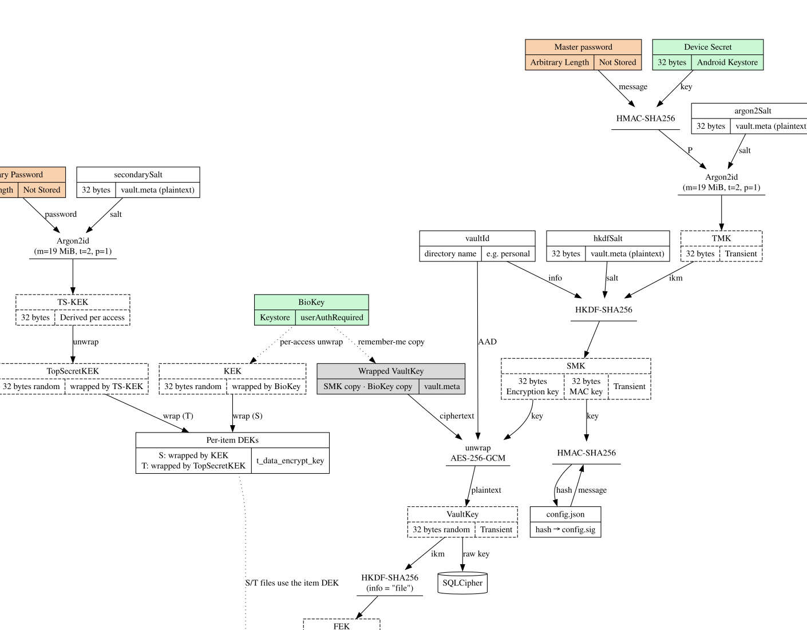

# Cryptowl — Encryption & Vault Design

Local-first encrypted vault for Android (notes, passwords, photos/videos). This document specifies the key hierarchy, per-vault storage layout, content security levels, and operational flows (unlock, rotation, backup, photo capture). Terminology follows KeePass/Bitwarden conventions and matches `docs/encryption.dot`.



## Core Principles

- **Zero-knowledge**: the master password never leaves the user's mind; all keys are derived locally.
- **Device binding**: every vault is bound to the physical device via a Device Secret stored in Android Keystore (non-exportable).
- **Per-vault isolation**: each vault lives in its own directory with independent cryptographic material (salts, wrapped keys).
- **Envelope encryption**: password-derived keys only *unwrap* random long-term keys; item data is encrypted by per-item DEKs. Master password changes therefore require rewrapping only — no data re-encryption, no database rekey.
- **Authenticated everywhere**: every AES-256-GCM operation binds the record id as AAD (prevents ciphertext-swap attacks).

## Terminology

| Term | Length | Stored location | Derivation | Description |
| --- | --- | --- | --- | --- |
| Master Password | arbitrary | not stored (user's mind) | user input | User-chosen password. Never stored, never transmitted. |
| Device Secret | 32 B | Android Keystore (non-exportable) | `CSPRNG(32)` | Generated at first launch. Binds a vault to the device. |
| TMK | 32 B | in memory only (transient) | `Argon2id(P, salt=argon2Salt)`, where `P = HMAC-SHA256(key=DeviceSecret, msg=MasterPassword)` | *Transformed Master Key* — Argon2id output of the master password + Device Secret. |
| SMK | 64 B | in memory only (transient) | `HKDF-SHA256(ikm=TMK, salt=hkdfSalt, info=vaultId, L=64)` | *Stretched Master Key* — HKDF expansion of the TMK. First 32 bytes unwrap VaultKey; last 32 bytes are the config MAC key. |
| VaultKey | 32 B | wrapped copies only (vault.meta / t_wrapped_key) | `CSPRNG(32)` | Random long-term key; used as the SQLCipher raw key. Never stored in plaintext. |
| KEK | 32 B | wrapped by BioKey only (vault.meta / t_wrapped_key, role='kek') | `CSPRNG(32)` | *Key Encryption Key* — random long-term key that wraps record DEKs and file DEKs (Secret tier). Unwrapped per access via fingerprint; the password chain never wraps it. Never stored in plaintext. |
| DEK | 32 B | wrapped (t_data_encrypt_key, per item) | `CSPRNG(32)` per item | *Data Encryption Key* — random per-item key (AES-256-GCM); encrypts the record's content *and* its files at S/T tiers. |
| FEK | 32 B | derived (not stored) | `HKDF-SHA256(VaultKey, info="file")` | *File Encryption Key* — C-tier files are encrypted with this VaultKey-derived key, so they share the DB's key material without key reuse. |
| TS-KEK | 32 B | not stored (derived per access) | `Argon2id(SecondaryPassword, salt=secondarySalt)` | *Top-Secret KEK* — Argon2id output of the secondary password. |
| TopSecretKEK | 32 B | wrapped copies only (vault.meta / t_wrapped_key) | `CSPRNG(32)` | Random key that wraps Top-Secret DEKs. Never stored in plaintext. |
| BioKey | AES-256 (Keystore key) | Android Keystore | Keystore keygen (`KeyGenParameterSpec`, TEE/StrongBox) | Created with `setUserAuthenticationRequired(true)` (StrongBox when available); every use requires a fresh `BiometricPrompt`. |
| Wrapped Key | key + nonce + auth tag (variable) | vault.meta / database | `AES-256-GCM(key, wrapper, nonce, AAD=role_id)` | Ciphertext blob of an encrypted key, optionally with AAD. |
| MAC Key | 32 B | derived in memory (SMK[32:64]) | `SMK[32:64]` | HMAC-SHA256 key for config integrity. |
| Secondary Password | arbitrary | not stored (user's mind) | user input | Second user-chosen passphrase for the Top-Secret tier; never derived from the master password. Derives TS-KEK via Argon2id. |
| vaultId | arbitrary (directory name) | vault directory name (e.g. `personal`) | vault creation | Vault identity; used as HKDF `info` and as AAD on wrapped-key copies so keys never cross vault boundaries. |
| Salt | 32 B each | vault.meta (plaintext, public) | `CSPRNG(32)` per vault | Per-vault `argon2Salt`, `hkdfSalt`, `secondarySalt`; domain-separate each KDF step. |
| Recovery Key | 32 B | not stored (shown once, printable) | `CSPRNG(32)` | Opt-in backup key; encrypts `.vbp` exports; not used in daily key derivation. |
| AAD | variable | — | — | *Additional Authenticated Data* — bound to every AES-256-GCM operation (record id / wrapped-key id) to prevent ciphertext-swap attacks. |
| config.json | — | vault root (plaintext) | — | Non-sensitive vault configuration (name, icon, sort order...). |
| config.sig | 32 B | vault root | `HMAC-SHA256(config.json, MACKey)` | Integrity signature of config.json; verified on every vault open. |
| vault.meta | — | vault root | — | Vault metadata file: salts (plaintext) + wrapped keys + kdf params (wrapped keys are ciphertext). |
| vault.db | — | vault root | — | SQLCipher-encrypted database (VaultKey as raw key). |
| t_wrapped_key | — | vault.db | — | Table of wrapped key copies (role, parent, ciphertext blob). |
| t_data_encrypt_key | — | vault.db | — | Table of wrapped DEKs (one per record/file). |
| SQLCipher | — | — | — | SQLite fork with AES-256 page encryption; the at-rest boundary for L0/L1 data. |
| BiometricPrompt | — | — | — | Android biometric auth dialog; a fresh prompt is required for every BioKey use. |
| .vbp | — | exported file | — | Single-file AES-256-GCM encrypted ZIP backup/export container. |
| Classification | — | — | — | C/S/T tiers (Confidential/Secret/Top Secret) mapping to L1/L2/L3 — see Content Security Levels. |
| Crypto algorithms | — | — | — | Argon2id (password KDF), HKDF-SHA256 (key stretch), HMAC-SHA256 (integrity), AES-256-GCM (key wrap + data), CSPRNG (randomness). |

Argon2id parameters: m=19 MiB, t=2, p=1 (see Key Hierarchy). `CSPRNG(n)` = n bytes from a cryptographically secure random generator.

## Key Hierarchy

```
Master Password ──HMAC-SHA256(Device Secret)──▶ Argon2id (salt = argon2Salt) ──▶ TMK (32 B)
TMK ──HKDF-SHA256 (salt = hkdfSalt, info = vaultId)──▶ SMK (64 B)

SMK[0:32] ──unwrap──▶ VaultKey (random 32 B) ──▶ SQLCipher raw key
SMK[32:64] ──▶ MAC Key ──▶ config.sig (HMAC-SHA256)

KEK (random 32 B) ──wraps──▶ per-item DEKs (record content + files)   (per-access: BioKey → KEK → DEK)

Secondary Password ──Argon2id (salt = secondarySalt)──▶ TS-KEK ──unwrap──▶ TopSecretKEK (random 32 B) ──wraps──▶ Top-Secret DEKs

BioKey (Keystore) ──wraps──▶ VaultKey · KEK · TS-KEK   (fingerprint "remember me" + per-access)
```

- **Per-vault salts** (`argon2Salt`, `hkdfSalt`, `secondarySalt`): 32 bytes each, CSPRNG, generated at vault creation. Salts are public — stored plaintext in `vault.meta`.
- **vaultId**: the vault's identity — its directory name (e.g. `personal`). Used as HKDF `info` and as AAD on wrapped-key copies so keys never cross vault boundaries.
- **Argon2id parameters**: m=19 MiB, t=2, p=1 (OWASP minimum; the same settings used in `Argon2Test`). Parameters are recorded in `vault.meta` and read from there at derive time so they can be raised in future versions.
- **Wrapped keys** are stored per vault (in `vault.meta` and/or the `t_wrapped_key` table). Each long-term key may have several wrapped copies:
  - `VaultKey` wrapped by SMK (password unlock) and by BioKey (fingerprint unlock) — SMK wraps nothing else
  - `KEK` wrapped by BioKey only — unlocked per access via fingerprint; the password chain never wraps it
  - `TS-KEK` wrapped by BioKey
  - `TopSecretKEK` wrapped by TS-KEK
- **Wrapping-key separation**: each wrapping key serves a single role, and every wrapped copy binds its role via AAD (wrapped-key id) — no key is reused for two purposes.

## Vault Storage Layout

```
/data/data/<pkg>/vaults/
├── personal/                  # vault root directory
│   ├── vault.db               # SQLCipher database (VaultKey as raw key)
│   ├── vault.meta             # salts + wrapped keys + kdf params (wrapped keys are ciphertext)
│   ├── config.json            # plaintext configuration (name, icon, sort order...)
│   ├── config.sig             # HMAC-SHA256 of config.json (MAC Key)
│   ├── attachments/           # AES-256-GCM encrypted files (photos, documents)
│   └── thumbnails/            # encrypted thumbnails (same key as the original)
├── work/
│   └── ...
└── archive/
    └── ...
```

Global files (outside vaults):

- `global_prefs.xml`: non-sensitive settings (theme, auto-lock timeout...)
- `vault_index.json`: list of vault IDs and display names

## Content Security Levels

| Level | Classification | Examples | Encryption | Unlock condition |
| --- | --- | --- | --- | --- |
| L0 | — | titles, timestamps, searchable attributes | SQLCipher only | vault unlock (master password or fingerprint) |
| L1 | C — Confidential | notes, diary entries | SQLCipher only | vault unlock (master password or fingerprint) |
| L2 | S — Secret | website logins, credit cards | per-record DEK (AES-256-GCM) | **explicit fingerprint per access** |
| L3 | T — Top Secret | sensitive documents, private photos | per-record DEK (AES-256-GCM), DEK wrapped by TopSecretKEK | **fingerprint + secondary password per access** |

- L0/L1 data is plaintext *inside* the SQLCipher-encrypted database — encrypted at rest, decrypted on unlock. SQLCipher is the boundary.
- L2 adds defense-in-depth: the DEK is unwrapped fresh for every access (`BioKey → KEK → DEK → content`) and not cached between accesses; each password view requires a new `BiometricPrompt`.
- L3 is true two-factor: the BiometricPrompt (BioKey unwraps TS-KEK) *and* the secondary password (TS-KEK derivation) are both required for every access. Fingerprint alone cannot bypass the secondary password.
- AAD on every AEAD operation is the record id (DEK wrap: DEK id; content: encrypted-data row id; file: file id).
- Classifications map to the `t_password.classification` schema convention; policies can be tightened later without schema changes.

## File Encryption by Tier

Encryption is **consistent between the database and files at every tier**: a file's protection never diverges from its record's classification.

| Tier | Database content | Files | Key available |
| --- | --- | --- | --- |
| C — Confidential | SQLCipher only (VaultKey) | whole-file AES-256-GCM with FEK = `HKDF-SHA256(VaultKey, info="file")` | after vault unlock (password or fingerprint remember-me) |
| S — Secret | per-item DEK, AES-256-GCM, wrapped by KEK | **same per-item DEK**, whole-file AES-256-GCM | fingerprint per access |
| T — Top Secret | per-item DEK, AES-256-GCM, wrapped by TopSecretKEK | **same per-item DEK**, whole-file AES-256-GCM | fingerprint + secondary password per access |

- **C tier**: files share the DB's key material — FEK is derived from VaultKey (the SQLCipher key), so no separate wrapped key is stored; nothing extra is unlocked.
- **S/T tiers**: one per-item DEK encrypts both the record content and the item's files (AAD = record id for the row, file id for each file). No per-file keys — a single unwrap yields both.
- Thumbnails are encrypted with the same key as their original (C: FEK; S/T: the item's DEK).

## Fingerprint / Biometric Unlock

A dedicated BioKey (AES-256-GCM, bound to biometric authentication) is created in Android Keystore with `setUserAuthenticationRequired(true, 0)`.

- **Remember me (vault unlock)**: during setup, `VaultKey` is also wrapped with BioKey → stored. On fingerprint unlock: `BiometricPrompt → decrypt wrapped VaultKey using BioKey → open SQLCipher`. The master password is not needed until the next cold start or a biometric enrollment change (Keystore invalidates the key on enrollment change).
- **Per-access (Secret tier)**: for each password view, a fresh `BiometricPrompt` unwraps the KEK via BioKey → item DEK → content. Nothing is cached between accesses.
- **Top-Secret tier**: a fresh prompt unwraps TS-KEK via BioKey, combined with the secondary password (see above).

## Master Password Change (Fast)

Thanks to the envelope design, the SQLCipher key (VaultKey) never changes:

1. Verify old password → derive old TMK/SMK → unwrap `VaultKey` with the old SMK.
2. Derive new TMK/SMK from the new password.
3. Re-wrap `VaultKey` with the new SMK; update the wrapped copy in `vault.meta`. The KEK (BioKey-wrapped) is untouched.
4. No `PRAGMA rekey`, no DEK rewrapping, no data re-encryption — the process is O(1), completing in milliseconds even for large vaults.

## Secondary Password Change

1. Derive the new TS-KEK from the new secondary password.
2. Unwrap `TopSecretKEK` with the old TS-KEK, rewrap with the new one.
3. Only Top-Secret key chain is touched — no item data re-encryption.

## Recovery Mechanism

- **Default**: no recovery. Forgetting the master password means permanent data loss.
- **Opt-in**: a 32-byte Recovery Key is generated during initial setup (shown once, printable).
- The Recovery Key is *not* used in daily key derivation. It is used to encrypt an offline backup of the vault (`.vbp`).
- To restore: provide the `.vbp` file + Recovery Key → decrypt → re-bind to the current device's Device Secret.

## Backup / Export Format (.vbp)

Each vault can be exported as a single encrypted container:

```
personal.vbp  (AES-256-GCM encrypted ZIP)
├── manifest.json
├── vault.db
├── vault.meta
├── config.json
├── attachments/*.enc
└── thumbnails/*.enc
```

- The container key is derived from a user-supplied export passphrase (Argon2id + HKDF) — or from the Recovery Key — never from the master password. A backup cannot be decrypted from vault-unlock state alone, and a master password change does not invalidate it.
- The vault is re-bound to the current device's Device Secret on import (new wrapped copies are created; the exported bundle never contains plaintext keys).
- Versioned bundle header for forward-compatible upgrades.

## In-App Photo Capture

- Custom CameraX preview (no system camera intent).
- Captured image stays in memory → immediately AES-256-GCM encrypted (C tier: FEK; S/T tier: the item's DEK).
- Encrypted file written to `<vault>/attachments/<uuid>.enc`; thumbnail generated and encrypted with the same key.
- Only the CAMERA permission is required; no storage permission needed.
- No plaintext touches disk.

## Integrity Protection

- `config.json` is signed with HMAC-SHA256 (MAC Key = SMK[32:64]); the signature is stored in `config.sig` and verified on every vault open; mismatch triggers a tamper warning (no silent fallback).
- Wrapped keys carry their own AEAD auth tags (AAD = wrapped-key id).
- Atomic writes (write to `.tmp`, then rename) prevent corruption.

## Memory Protection

Encryption at rest is meaningless if keys and plaintext linger in memory. This section specifies how secrets are held, for how long, and what happens to them on lock.

### Threat model

| Threat | Defeated by |
| --- | --- |
| Rooted device memory dump / `/proc/pid/mem` read | short key lifetimes, off-heap buffers, no persistent plaintext copies |
| Crash dumps / tombstone files | no secrets on the heap → nothing to leak into `dumpsys`/ANR traces; `java` exceptions never carry key material |
| Debugger attach (debuggable builds only) | release builds are `minifyEnabled` + `debuggable=false`; JNI verifies no debugger attach |
| Swap/paging (Android uses zram, no disk swap) | zram pages can be compressed in memory; minimized resident copies reduce exposure |
| Clipboard/pasteboard leak | passwords never transit the clipboard (in-app views only) |
| Screen recording / screenshot during display | `FLAG_SECURE` on vault screens (optional per-tier setting) |

### Key residency

All derived/random keys (TMK, SMK, VaultKey, KEK, DEKs, TS-KEK, TopSecretKEK, MAC Key) are **transient in memory only**, held inside a `ProtectedValue` — never as plain `ByteArray` on the managed heap:

- **Off-heap storage**: the canonical copy lives in an unmanaged direct `ByteBuffer`, so GC compaction never moves or duplicates it; it is scrubbed by writing zeros over the buffer.
- **Scoped access**: `use {}` copies to a heap byte array for the duration of a JNI/JCA call and zero-fills it in `finally` — the heap copy exists only for the call frame.
- **Cleaner backstop**: a `java.lang.ref.Cleaner` scrubber zeroes the buffer even if the caller drops the value without `clear()`; explicit `clear()` is preferred for deterministic wiping.
- **No `String` secrets**: secrets are `ProtectedValue` end-to-end; `String` conversions exist only at the input boundary (password field → `fromString`) and are immediately scrubbed. `getText()` output is cleared on return.
- **No logs, no persistence**: key material is never logged, included in exception messages, or serialized.

### Lifecycle rules

- **Derive → unwrap → use → wipe**: keys are derived on demand and wiped as soon as the operation completes. Unwrapped intermediates (e.g. SMK after VaultKey unwrap) are cleared immediately; VaultKey persists for the session as the SQLCipher key.
- **Per-access keys (L2/L3)**: KEK/TS-KEK/DEKs are unwrapped fresh per access and cleared when the view closes — nothing is cached between accesses (see Content Security Levels).
- **Lock clears everything**: on auto-lock, biometric-lock, or app backgrounding, all in-memory key material is wiped (VaultKey session key zeroized; SQLCipher `PRAGMA key` state dropped by closing the DB), returning the app to the locked state.
- **Keystore boundary**: BioKey/Device Secret never enter app memory at all — Keystore (TEE/StrongBox) holds and uses them; only their *outputs* (decrypted wrapped keys) touch app memory, and only transiently.
- **Password buffers**: the password field input is read into a `ProtectedValue` and the input widget's backing buffer is zeroed; IME composition buffer contents are outside app control (device-dependant) — `FLAG_SECURE` mitigates exposure.
- **Cold start**: after unlock the master password is not retained in memory for later re-locks; each unlock re-derives from fresh user input.

### Boundaries with crypto native code

- `ProtectedValue.use {}` provides the byte array for `Argon2.kt` JNI calls and JCA `SecretKeySpec` construction; the key spec reference is dropped and the array cleared in `finally`.
- The `secretKeySpec` passed to SQLCipher is a JCA object wrapping the (heap) key bytes — SQLCipher copies it internally at `sqlite3_key`; the app clears its own copy after opening.
- The vendored Argon2 code internally uses caller-owned buffers only; no additional copies are made at the JNI boundary.

## Summary Diagram

```
Master Password ──┬── HMAC(Device Secret) ── Argon2id ── TMK ── HKDF ── SMK ──unwrap──▶ VaultKey ──▶ SQLCipher (L0/L1)
                  │                                          │                    ├─ SMK[32:64] ──▶ config.sig
                  │                                          │                    └─ VaultKey ──HKDF──▶ FEK ──▶ C-tier files
                  │
                  ├── Fingerprint (remember me) ── BioKey ──unwrap──▶ VaultKey ──▶ SQLCipher
                  │
                  └── per-access: Fingerprint ── BioKey ──unwrap──▶ KEK ──▶ per-item DEK ──▶ L2 content + files

Secondary Password ── Argon2id ── TS-KEK ◀──unwrap── BioKey (fingerprint)
                         │
                         └──unwrap──▶ TopSecretKEK ──wraps──▶ T-tier DEK ──▶ L3 content + files
```
